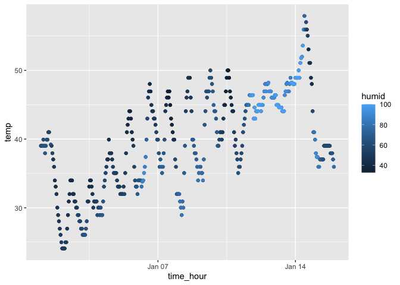

Homework 1
================
Youssra Yemmas
2023-09-24

# Section 0: This Line of code loads the necessary packages

# Section 1: This chunk of code loads the early_january_weather data set and describes it

### I first used the view function within tibble to view in a separate window all of the 15 variables and 358 observations contained in the dataset. It allows me to see all the variable names and observation: origin(EWR), year(2013), month(01), day(01), hour, temp, dewp, humid, wind_dir, wind_speed, wind_gust, precip, pressure, visib, time_hour,

``` r
data("early_january_weather")
view(early_january_weather)
```

# Section 2: This chunk of code looks at some important values of some of the variables

### This is how I can see there are 15 columns and 358 rows. I can also see that the mean temperature is 39.58212, the mean dew point is 28.05709, the average humidity is 56.4767, and the average windspeed is 8.225827.

``` r
# Presenting the number of rows in the data frame
nrow(early_january_weather)
```

    ## [1] 358

``` r
# Presenting the number of columns in the data frame
ncol(early_january_weather)
```

    ## [1] 15

``` r
# Calculating the means of four numeric variables
mean(early_january_weather$temp)
```

    ## [1] 39.58212

``` r
mean(early_january_weather$dewp)
```

    ## [1] 28.05709

``` r
mean(early_january_weather$humid)
```

    ## [1] 65.4767

``` r
mean(early_january_weather$wind_speed)
```

    ## [1] 8.225827

# Section 3: Making a plot of the temperature variable as y versus the time in hours variable as the x.

### I notice from the plot that there seems to be an upward trend of temperature across time but there is a lot of variability within as the temperature goes from above 40 degrees to below 25 in the first hours of Jan 07. Utilizing the variabile of humidity to color the points reveals that humidity may be a contributing factor for some of the large variability in temperatures as point on the higher end of the temperature scale tend to be lighter colored indicating higher humidity.

``` r
ggplot(data = early_january_weather, 
       mapping = aes(x = time_hour, y = temp)) + geom_point() + geom_point( mapping = aes(x = time_hour, y = temp, color = humid))
```

<!-- -->

``` r
ggsave("temp_time.pdf")
```

    ## Saving 7 x 5 in image

# Section 4: Creating a data frame comprised of a random sample of size 10 from a standard Normal distribution, a logical vector indicating whether elements of the sample are greater than 0, a character vector of length 10, and a factor vector of lenght 10, with 3 different factor levels.

``` r
# Set a seed for reproducibility
set.seed(123)

# Create a random sample of size 10 from a standard Normal distribution
random_sample <- rnorm(10)

# Create a logical vector indicating whether elements of the sample are greater than 0
logical_vector <- random_sample > 0

# Create a character vector of length 10
char_vector <- c("A", "B", "C", "D", "E", "F", "G", "H", "I", "J")

# Create a factor vector of length 10 with 3 different factor levels
factor_vector <- factor(sample(1:3, 10, replace = TRUE), levels = 1:3, labels = c("Level1", "Level2", "Level3"))

# Create the data frame
hw1_data_frame <- data.frame(
  RandomSample = random_sample,
  IsGreaterThanZero = logical_vector,
  CharacterVector = char_vector,
  FactorVector = factor_vector
)

# Display the data frame
print(hw1_data_frame)
```

    ##    RandomSample IsGreaterThanZero CharacterVector FactorVector
    ## 1   -0.56047565             FALSE               A       Level1
    ## 2   -0.23017749             FALSE               B       Level1
    ## 3    1.55870831              TRUE               C       Level1
    ## 4    0.07050839              TRUE               D       Level1
    ## 5    0.12928774              TRUE               E       Level3
    ## 6    1.71506499              TRUE               F       Level2
    ## 7    0.46091621              TRUE               G       Level3
    ## 8   -1.26506123             FALSE               H       Level2
    ## 9   -0.68685285             FALSE               I       Level1
    ## 10  -0.44566197             FALSE               J       Level2

# Section 5: Trying to take the mean of each variable in the data frame

``` r
# Using the pull function to take the variable random_sample out of the data frame
hw1_data_frame %>% pull(RandomSample)
```

    ##  [1] -0.56047565 -0.23017749  1.55870831  0.07050839  0.12928774  1.71506499
    ##  [7]  0.46091621 -1.26506123 -0.68685285 -0.44566197

``` r
# Assigning a value to the mean of the numeric random_sample
numeric_mean <- mean(random_sample)
print(numeric_mean)
```

    ## [1] 0.07462564

``` r
# Trying to take the mean of the logical vector
logical_mean <- mean(logical_vector)
print(logical_mean)
```

    ## [1] 0.5

``` r
# This time trying with the factor variable
factor_mean <- mean(factor_vector)
```

    ## Warning in mean.default(factor_vector): argument is not numeric or logical:
    ## returning NA

``` r
#This does not work because the variable is not numeric or logical
?pull()
?sapply
```
